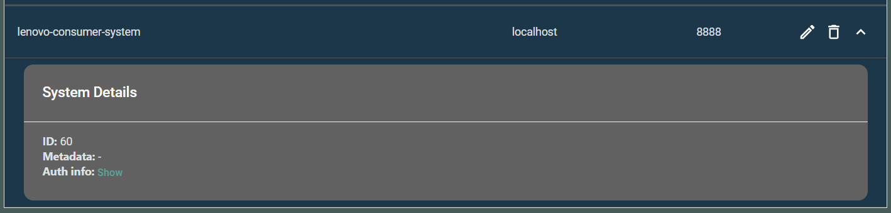
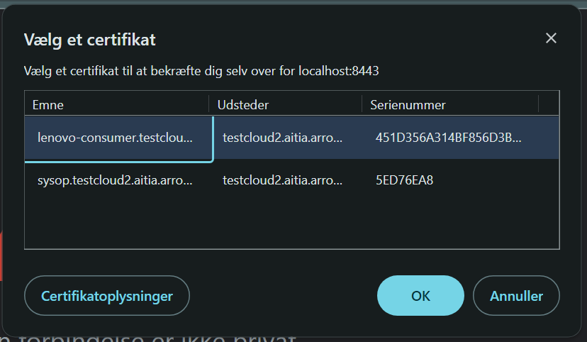

<!-- TOC start (generated with https://github.com/derlin/bitdowntoc) -->

- [Prerequisities](#prerequisities)
- [Hidtil implementering](#hidtil-implementering)
    * [Provider](#provider)
    * [Consumer](#consumer)
        + [Reproduktion af problemet](#reproduktion-af-problemet)
        + [Allerede forsøgte løsninger](#allerede-forsøgte-løsninger)

<!-- TOC end -->

<!-- TOC --><a name="prerequisities"></a>
# Prerequisities
Download & konfigurer en Arrowhead Local Cloud fra [det officielle github repository](https://github.com/eclipse-arrowhead/core-java-spring). Vær opmærksom på, at der er specificeret yderligere prerequisities i README for omtalte repository.
Følg YouTube-videoen AITIA har lavet, som introducerer local cloud systemet. Videoen kan findes [her](https://www.youtube.com/watch?v=52Up5iDJKx4).
Når denne video er gennemført og du har en grundlæggende forståelde for, hvordan systemet virker, anbefales det at hente [Arrowhead's Management Tool](https://aitia.ai/downloads/ah-mgmt-tool/), som er en grafisk brugerflade til overblik over services og systems i din local cloud.
<!-- TOC --><a name="hidtil-implementering"></a>
# Hidtil implementering
<!-- TOC --><a name="provider"></a>
## Provider
Provider-koden er indrettet således, at den ved kørsel først og fremmest vil oprette de tre provider-services som er angivet i  tjekke om databasen specificeret i application.properties er seeded med nogle testdata:
```BASH
+----+----------+------------------+--------------+-------------------+
| id | name     | fingerprint_hash | id_card_hash | facial_recog_hash |
+----+----------+------------------+--------------+-------------------+
|  2 | John Doe |           123456 |       654321 |            987654 |
+----+----------+------------------+--------------+-------------------+
```
Tilmed oprettes der 3 service-definitions som vist underneden 

![[service-definitions]](./img/service-definitions.png)

Derudover er der oprettet et provider-system kaldet "lenovo-provider", hvilket er specificeret i providerens tilhørende application.properties.
Det er utroligt vigtigt, at navnet på provider-systemet er identisk med navnet på dit SSL licens. En guide til at lave sit eget licens kan findes i [denne undermappe](https://github.com/eclipse-arrowhead/core-java-spring/tree/master/documentation/certificates) fra det officielle repository.
Den nuværende konfiguration virker udmærket, så til at starte med burde denne konfiguration være tilstrækkelig.

<!-- TOC --><a name="consumer"></a>
## Consumer
Problemet med koden opstår i consumeren. Koden er indrettet til, at der laves en orchestration request til Arrowhead's Orchestration Service, som returnerer en liste af services, der matcher de angivne kriterier.
Problemet er bare, at der uanset hvad returneres et tomt array, så orchestration response altså er tomt:
```JSON
2024-09-05 11:25:10.422  INFO 9556 --- [  restartedMain] e.a.a.s.c.ConsumerMain                   : Service query form constructed:
{
  "serviceDefinitionRequirement" : "id-card-reader",
  "interfaceRequirements" : [ "HTTP-SECURE-JSON" ],
  "securityRequirements" : null,
  "metadataRequirements" : null,
  "versionRequirement" : null,
  "minVersionRequirement" : null,
  "maxVersionRequirement" : null,
  "providerAddressTypeRequirements" : null,
  "pingProviders" : false
}
2024-09-05 11:25:10.436  INFO 9556 --- [  restartedMain] e.a.a.s.c.ConsumerMain                   : Orchestration request constructed:
{
  "requesterSystem" : {
    "systemName" : "lenovo-consumer",
    "address" : "localhost",
    "port" : 8888,
    "authenticationInfo" : "MIIBIjANBgkqhkiG9w0BAQEFAAOCAQ8AMIIBCgKCAQEAqWdqKIUsgO1ow3VWCMUGa3hd/kmC8iDvmE3JuVMdgrNt4AOTye5KNYva3vQ0iQ91gguQ+OfjOSkUETzx/jwfMqQzPBzircqZE4+kB1VS+TvOkZCxhcfP5rW/cGt5KpyhCmjwpGZm+0tmYdZySF0VfAuC2SF8K9NPSOtxM8fivOwMyW5UDrRUpJRxwQV70cxWdS2qIS84hI+hUSvHxo+FHMYeVAjLSz4N0iyPjrPQLhCFDl/4oMtsZ3YZ60iwXT8EKtUFoulHasaI6Mmz95h2nM0TuHsCx9x2/9wUjn504kVzjRkK7Vw18LR2YBrGHSLRWsTzEcMUlRIq00Is2gD8+QIDAQAB",
    "metadata" : null
  },
  "requesterCloud" : null,
  "requestedService" : {
    "serviceDefinitionRequirement" : "id-card-reader",
    "interfaceRequirements" : [ "HTTP-SECURE-JSON" ],
    "securityRequirements" : null,
    "metadataRequirements" : null,
    "versionRequirement" : null,
    "minVersionRequirement" : null,
    "maxVersionRequirement" : null,
    "providerAddressTypeRequirements" : null,
    "pingProviders" : false
  },
  "orchestrationFlags" : {
    "onlyPreferred" : false,
    "overrideStore" : true,
    "onlyIPAddressResponse" : false,
    "externalServiceRequest" : false,
    "onlyIPv4AddressResponse" : false,
    "onlyIPv6AddressResponse" : false,
    "enableInterCloud" : false,
    "enableQoS" : false,
    "matchmaking" : false,
    "metadataSearch" : false,
    "triggerInterCloud" : false,
    "pingProviders" : false
  },
  "preferredProviders" : [ ],
  "commands" : { },
  "qosRequirements" : { }
}
2024-09-05 11:25:10.441 DEBUG 9556 --- [  restartedMain] a.a.a.a.l.ArrowheadService               : 'ORCHESTRATION_SERVICE' core service is not contained by Arrowhead Context.
2024-09-05 11:25:10.441 DEBUG 9556 --- [  restartedMain] a.a.a.a.l.ArrowheadService               : Orchestration couldn't be proceeded due to the following reason: ORCHESTRATION_SERVICE not known by Arrowhead Context
2024-09-05 11:25:10.441  INFO 9556 --- [  restartedMain] e.a.a.s.c.ConsumerMain                   : Orchestration response received:
null
2024-09-05 11:25:10.441 ERROR 9556 --- [  restartedMain] e.a.a.s.c.ConsumerMain                   : Orchestration response is null. Throwing InvalidParameterException...
2024-09-05 11:25:10.442 ERROR 9556 --- [  restartedMain] e.a.a.s.c.ConsumerMain                   : InvalidParameterException caught: Orchestration response is empty
```

<!-- TOC --><a name="reproduktion-af-problemet"></a>
### Reproduktion af problemet
**Fra SwaggerUI:**
1. Gå til https://localhost:8443/swagger-ui.html, og henvis da til endpoint'et "/serviceregistry/mgmt/systems" under "Client"-menuen.
2. Indtast følgende JSON i request body:
```JSON
{
  "address": "localhost",
  "authenticationInfo": "consumer-auth",
  "port": 8888,
  "systemName": "lenovo-consumer-system"
}
```
3. Dit system er nu registreret under [systemName] i din local cloud:

   
4. Det er nu tid til at lave en intracloud authorization rule. Gå til endpoint'et "/authorization/mgmt/intracloud" under "Client"-menuen, på https://localhost:8445/swagger-ui.html.
5. Indtast følgende JSON i request body (hvor der udfyldes med respektive systemId'er mv.) f.eks.:
```JSON
{
  "consumerId": 60, // ID of your newly registered system
  "interfaceIds": [ // ID's of the preferred interface e.g. HTTP-SECURE-JSON or HTTP-INSECURE-JSON
    0
  ],
  "providerIds": [ // ID of the provider system(s)
    58
  ],
  "serviceDefinitionIds": [ // ID of the service definition(s) e.g. id-card-reader
    84, 85, 86
  ]
}
```
6. Nu er det tid til at lave en orchestration request. Gå til endpoint'et "/orchestration/mgmt/orchestration" under "Client"-menuen, på https://localhost:8445/swagger-ui.html.
7. Der indtastes følgende oplysninger i JSON request body:
```JSON
{
  "requesterSystem": {
    "systemName": "lenovo-consumer",
    "address": "localhost",
    "port": 8888,
    "authenticationInfo": "consumer-auth",
    "metadata": null
  },
  "requesterCloud": null,
  "requestedService": {
    "serviceDefinitionRequirement": "id-card-reader",
    "interfaceRequirements": [
      "HTTP-SECURE-JSON"
    ],
    "securityRequirements": null,
    "metadataRequirements": null,
    "versionRequirement": null,
    "minVersionRequirement": null,
    "maxVersionRequirement": null,
    "providerAddressTypeRequirements": null,
    "pingProviders": false
  },
  "orchestrationFlags": {
    "onlyPreferred": false,
    "overrideStore": true,
    "onlyIPAddressResponse": false,
    "externalServiceRequest": false,
    "onlyIPv4AddressResponse": false,
    "onlyIPv6AddressResponse": false,
    "enableInterCloud": false,
    "enableQoS": false,
    "matchmaking": false,
    "metadataSearch": false,
    "triggerInterCloud": false,
    "pingProviders": false
  },
  "preferredProviders": [],
  "commands": {},
  "qosRequirements": {}
}
```
**_Husk altid formaliteterne hvad angår navngivning af systemer og hvilket licens der er brugt..._**

Hvis alle disse trin er fulgt (og requests er udfyldt efter fomaliteter m.v., vil orchestration response returnere et tomt array.

**Fra IDE:**
1. Start Arrowhead Local Cloud
2. Kør Provider-programmet
3. Kør Consumer-programmet

**Bemærk;** Når der reproduceres i Orchestration Service's SwaggerUI, er der to mulige udfald... Enten returneres et tomt array, eller også returneres en "401 Unauthorized".
Hvis dette forekommer, kontroller da at "systemName" i request body stemmer overens med den SSL licens, du vælger når du indlæser siden. Eksempel på, hvordan det ser ud når du bliver promptet til at vælge licens:



<!-- TOC --><a name="allerede-forsøgte-løsninger"></a>
### Allerede forsøgte løsninger
1. Bekræftelse af at provider og consumer er på samme netværk
2. Bekræftelse af at provider's oplysninger stemmer overens med de, som bliver requested af orchestration
3. Parametre som fx serviceDefinitionRequirement, interfaceRequirements, securityRequirements, metadataRequirements, versionRequirement, minVersionRequirement, maxVersionRequirement, providerAddressTypeRequirements, pingProviders er blevet testet med forskellige værdier

Uanset hvad returnerer det altid et null-response.

